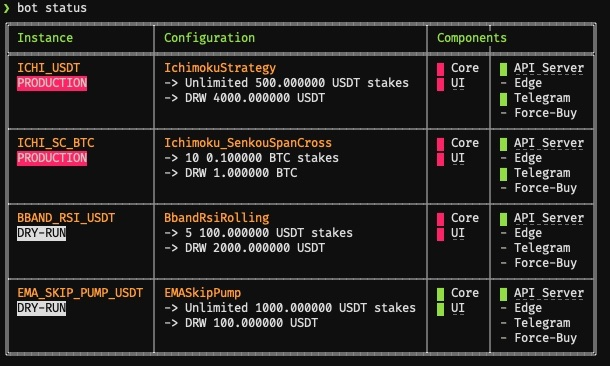
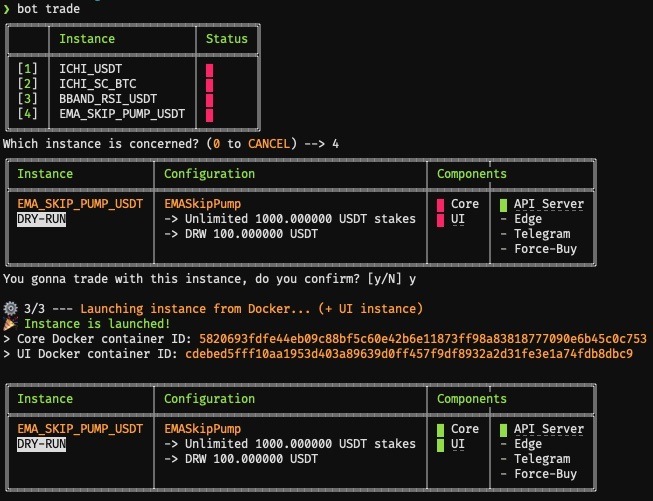

# Cryptocurrencies Trading Bot - Freqtrade Manager

This automated Trading Bot is based on the amazing [Freqtrade](https://www.freqtrade.io/en/latest/) one.
It allows you to manage many Freqtrade fully Dockerized instances with ease.
Each generated instance is accompagnated by its Freqtrade UI, automatically plugged to.

## Features

* **Fast & easy deploy** 🚀
* 1-line installation
* Pairlist generation from [Binance](https://www.binance.com/fr/register?ref=69525434) Markets (24h volume % based on) to improve pairs efficiency (other exchanges will come)
* Unlimited instances configurations from 1 only YAML file
* API endpoint and Freqtrade UI ports auto-generation and management
* Many more is coming!

## Requirements

* [Docker](https://www.docker.com/) #CaptainObvious

## Installation

Just 1 line to install your Trading Bot:

```
curl -sSL https://raw.githubusercontent.com/Ph3nol/Trading-Bot/master/install | sh
```

You now can access `bot` command.

Now, init a configuration, based on [demo one](https://github.com/Ph3nol/Trading-Bot-Config):

```
mkdir ~/trading-bot-config && cd ~/trading-bot-config
git clone https://github.com/Ph3nol/Trading-Bot-Config .
```

Congrats! 👏 You can now configure your `manager.yaml` file and run your first `bot status` command! 🚀🔥

### Crontab entry

A crontab entry is to add, in order to run periodic tasks needed by your instances and their behaviours.
To obtain this line and add it to your crontabs (`crontab -e`), just run this command:

```
bot cron --crontab
```

## Some screenshots





## Usage

Just use `./bot` from your Freqtrade Manager directory.

### Commands

From your config directory:

```
bot
bot status
bot trade
bot stop
bot reset

bot cron
bot cron --crontab
```

For more options informations, add `--help` to the base commands.

## Update

To update the Bot and its Docker images, just re-run install command:

```
curl -sSL https://raw.githubusercontent.com/Ph3nol/Trading-Bot/master/install | sh
```

---

## Thanks


You want to support this project?
You are using this project and you want to contribute?
Feeling generous?

* **BTC** -> `1MksZdEXqFwqNhEiPT5sLhgWijuCH42r9c`
* **ETH/USDT/..**. (or other ERC20 loving crypto) -> `0x3167ddc7a6b47a0af1ce5270e067a70b997fd313`
* Register to [Binance](https://www.binance.com/fr/register?ref=69525434) following this [sponsored link](https://www.binance.com/fr/register?ref=69525434)

---

## Development


### Execute as a PHP project

```
mkdir ~/trading-bot-dev
cd ~/trading-bot-dev && git clone https://github.com/Ph3nol/trading-bot.git .
ln -s $PWD/bot /usr/local/bin/trading-bot-dev
```

You can now go to your config directory, and use `trading-bot-dev` command instead of the production `bot` one.

### Build Docker images

```
docker build --file ./docker/freqtrade/Dockerfile --tag ph3nol/freqtrade:latest .
docker build --file ./docker/freqtrade-ui/Dockerfile --tag ph3nol/freqtrade-ui:latest .
docker build --file ./docker/manager/Dockerfile --tag ph3nol/freqtrade-manager:latest .
```
