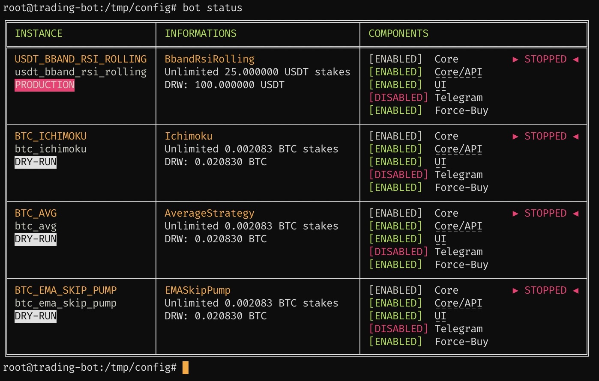
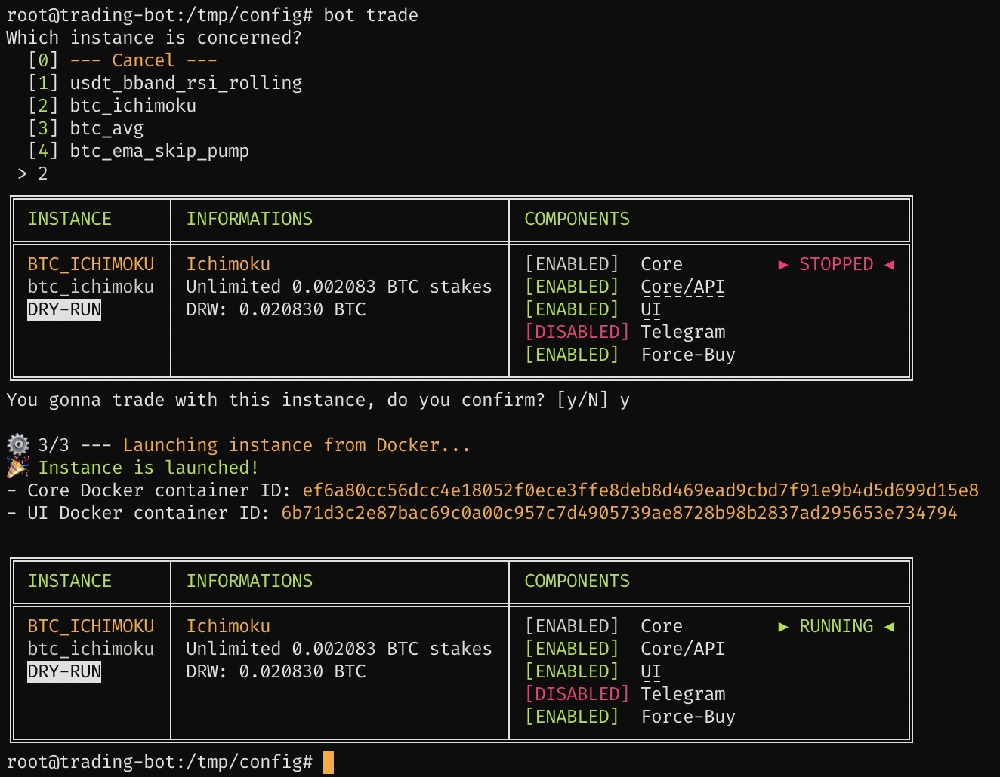
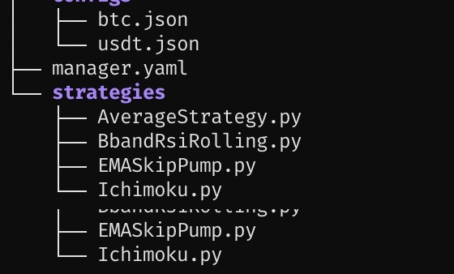

# Cryptocurrencies Trading Bot - Freqtrade Manager

This automated Trading Bot is based on the amazing [Freqtrade](https://www.freqtrade.io/en/latest/) one.
It allows you to manage many Freqtrade fully Dockerized instances with ease.
Each generated instance is accompagnated by its Freqtrade UI, automatically plugged to.

# Features

* **Fast & easy deploy** 🚀
* 1-line installation
* Pairlist generation from [Binance](https://www.binance.com/fr/register?ref=69525434) Markets (24h volume % based on) to improve pairs efficiency (other exchanges will come)
* Unlimited instances configurations from 1 only YAML file
* API endpoint and Freqtrade UI ports auto-generation and management
* Many more is coming!

## Installation

First, create a work directory, which will contain all required configurations, and go inside it, like this:

```
mkdir freqtrade-manager && cd freqtrade-manager
```

Now, just install, from your just-created Freqtrade Manager directory:

```
curl -sSL https://raw.githubusercontent.com/Ph3nol/Trading-Bot/master/install | sh
```

## Some screenshots





## Usage

Just use `./bot` from your Freqtrade Manager directory.

### Commands

```
bot
bot status
bot trade
bot stop
```

## Update

```
docker pull ph3nol/freqtrade:latest
docker pull ph3nol/freqtrade-ui:latest
docker pull ph3nol/freqtrade-manager:latest
```

---

## Thanks


You want to support this project?
You are using this project and you want to contribute?
Feeling generous?

* **BTC** -> `1MksZdEXqFwqNhEiPT5sLhgWijuCH42r9c`
* **ETH/USDT/..**. (or other ERC20 loving crypto) -> `0x3167ddc7a6b47a0af1ce5270e067a70b997fd313`
* Register to [Binance](https://www.binance.com/fr/register?ref=69525434) following this [sponsored link](https://www.binance.com/fr/register?ref=69525434)

---

## Development


### Execute as a PHP project

```
git clone https://github.com/Ph3nol/trading-bot.git
cd trading-bot
# Configure your `example/` Freqtrade Manager folder
cd example
../bot
```

### Build Docker images

```
docker build --file ./docker/freqtrade/Dockerfile --tag ph3nol/freqtrade:latest .
docker build --file ./docker/freqtrade-ui/Dockerfile --tag ph3nol/freqtrade-ui:latest .
docker build --file ./docker/manager/Dockerfile --tag ph3nol/freqtrade-manager:latest .
```
